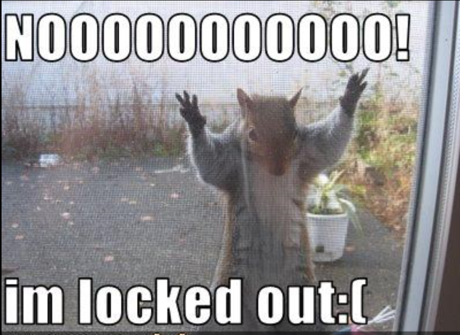

# Security 

#### What is security ?
 **"security is the state of being protected or safe"**

 ## Why to secure your web ?

 - websites can be viewed by anyone  
 we have to make sure they cannot go beyond allowed limit :)
- You have to make your users' information safe  
but wait brilliant star **don't over secure your web** 
  this will lock your real users outside  
 

<!-- [alt text](image.png) -->
   <p></p>

## Who are we securing our website against? ?

### What is a Hacker ?

A hacker is someone who explores or manipulates systems, sometimes ethically `(white-hat)` and sometimes maliciously `(black-hat)`

#### There is two types of hackers :

|white-hat| black-hat|
|----|----|
|they hack computer systems to find the problem and then they notify the owners . **they arn't trying to exploit those systems**| Those are the ones who's trying to exploit the systems . they will keep your computer like a **botnet**|

**Black-hat hackers** are the ones we want to prevent from taking over our websites or computer systems.

> botnet : A botnet is a group of infected devices controlled by a hacker to perform attacks.

#### Black-hat types :

- **Curiours users** :  
They try things out and look for information.
- **Script kiddie** :  
They don’t know how to write software, so they use scripts from the internet... *(Low-level hackers.)*
- **Thrill seekers** :  
They want to see what will happen and whether they can break into systems.  
They often target bigger systems just for the challenge.

- **Hacktivists** :  
Politically motivated people who try to hack large organizations *(e.g., FBI, CIA)*.

- **Trophy hunters** :  
they target the large systems because they want recogintion   
  *"i got this means i hacked this system"*

- **Profissinals** : hack for money  

## What is Social Engineering ?  

**Social engineering** is the act of persuading someone to give you confidential information, which can then be used to hack their account. *"manipulating people"*

#### How to avoid it :
- keep your confidential informations hidden 
- be careful what you share about yourself on social media

>Phishing : it's a type of social engineering where attackers create fake pages, forms, or links to trick you into entering your information.

## Keep functional code private 

To enhance security, it is critical to keep functional code (functions, classes, logic) separate from the files that users interact with.

- **Folder Separation** :  
Store functional code (functions and classes) in a private directory and user-facing files in a public directory. This ensures users cannot directly browse sensitive logic files.

- **Prevent Directory listing** :  
Stop users from seeing your file list by placing an empty `index.php` in every folder or using the line `Options -Indexes` in an `.htaccess` file.

- **Extension Safty** :  
Use `.php` for all sensitive data files (like configurations). Unlike `.json` or `.txt`, the server will not display PHP content as plain text if someone tries to access the file directly.


## PHP CODE INJECTION

When a website uses a `GET` variable to determine which file to include (e.g., `index.php?page=home`), it creates a major security hole if not properly sanitized
- **Directory Traversal** :  
Attackers can use `../` to move up the file system and access sensitive files like server logs or configuration files
-**Arbitrary Execution** :  
The `include` function executes any code inside tags, regardless of the file extension. An attacker can hide PHP code inside a `.txt` file or even a `.jpg` image and force the server to run it

### How to prevent it ? 

- **Force Extensions** : Do not allow the URL to specify the file extension. Instead, append `.php` in your code so only PHP files can be targeted

- **Image Processing** : If you allow image uploads, always **"crop"** or **resize** them on the server. This process reconstructs the image pixel-by-pixel, effectively stripping away any hidden PHP code or malicious metadata

- **Whitelist Pages** : only allow specific , pre-defined file names to be included .. you can do this manually or using `glob`

```php
$folder = "pages/"; // Directory where your page files are kept
$files = glob($folder . "*.php"); // Get all .php files in that folder

if (isset($_GET['page'])) {
    $requested_file = $folder . $_GET['page'] . ".php";

    if (in_array($requested_file, $files)) {
        // Safe: The file exists within our specific pages folder
        include($requested_file);
    } else {
        echo "Access Denied.";
    }
}

```

- **Using *`file_get_contents`*** : If the file you are loading doesn't need to execute logic, use *`file_get_contents()`* instead of *`include`*. This function will only read the file as text and will not execute any PHP code it contains


## Keep IT SIMPLE 

### Less Points of Entry :
A typical website with separate files like ``index.php`, `posts.php`, and `contact.php` has many "doors" or windows through which an attacker can enter
#### another problems :
- **Security Overhead**: If you discover a security flaw, you have to fix it in every single file manually

- **Redundant Logic**: Many files end up with duplicated code, such as separate database connections or session checks, increasing the risk of an error in one of them

### the solution is using **Single Point of Entry** (Front Controller) :

The goal is to funnel every request through one file —usually `index.php`— and have that file decide which content to load based on URL parameters .

- **Centralized Control** : You only need to apply security checks (like authentication or input sanitization) in one place.

- **Easier Debugging** : If there's a breach or an error, you know exactly where the application starts processing.

- **Hidden File Structure**: By moving your actual page content into an `includes` folder, users can no longer directly access those files via URL

### Segment Code :
- **URL Rewriting** :Configures an `.htaccess` file to transform messy query parameters (e.g., `index.php?page=login`) into clean, readable paths (e.g., `/login`).  

- **Modular Navigation**: Extracts the site's navigation links into a reusable `header.php` file that is included across different pages.
- **Folder Architecture** : Hardens security by splitting the project into a `public` folder (for user-facing files like `index.php` and `.htaccess`) and a private folder (to hide sensitive backend scripts and includes).

- **Centralized Functions**: Moves the database connection and query logic out of individual pages and into a dedicated `functions.php` file and require it in the main pages.

- **Reuseable code** : Creates specific functions like  `connect()` to establish database connections and `db_read()` to handle database queries and return data as an array.